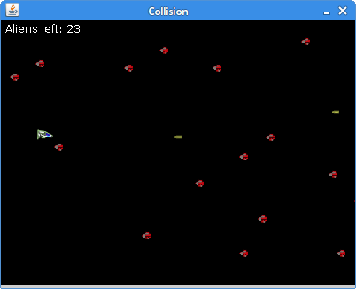
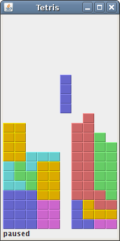

# Games with Java 2D

Simple Games using Java 2D


## Prerequires

1. Git 2.6+
2. Maven 3+
3. Java 8+


## How to Play

Clone

```
git clone https://github.com/humbertodias/games-with-java2d.git
```

Inside the folder

```
cd games-with-java2d
```

Run

```
mvn compile exec:java -Dexec.mainClass="pacman.Main"
```

```
mvn compile exec:java -Dexec.mainClass="breakout.Main"
```

```
mvn compile exec:java -Dexec.mainClass="pong.Main"
```

```
mvn compile exec:java -Dexec.mainClass="snake.Main"
```

```
mvn compile exec:java -Dexec.mainClass="sokoban.Main"
```

```
mvn compile exec:java -Dexec.mainClass="spacecraft.Main"
```

```
mvn compile exec:java -Dexec.mainClass="tetris.Main"
```

```
mvn compile exec:java -Dexec.mainClass="minesweeper.Main"
```

```
mvn compile exec:java -Dexec.mainClass="spaceinvaders.Main"
```

```
mvn compile exec:java -Dexec.mainClass="puzzle.Main"
```


## References

[ZedCode Tutorial](http://zetcode.com/tutorials/javagamestutorial/)

